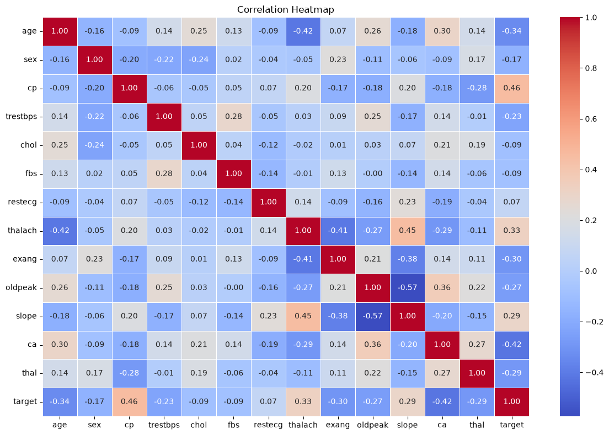
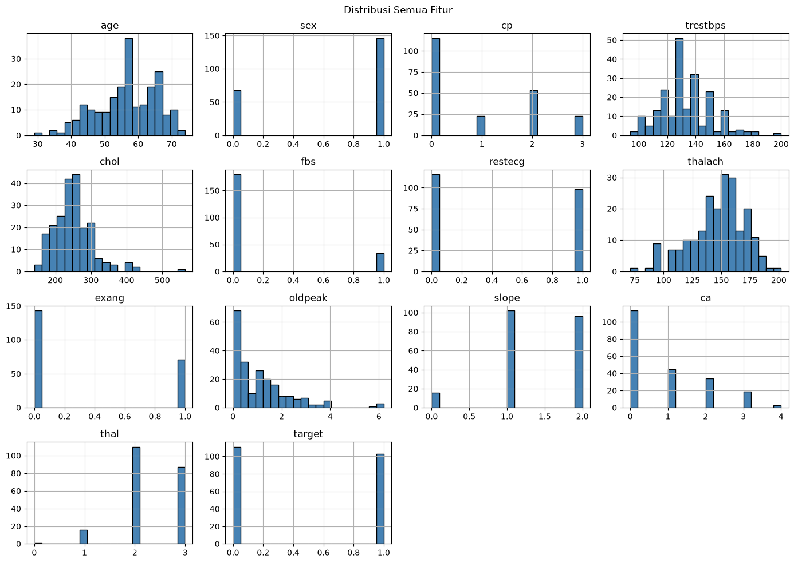

# Heart Disease ML Pipeline

An **automated data-preprocessing pipeline** for the Heart Disease UCI dataset, wired up with **GitHub Actions** so the data prep re-runs on every push — the data-engineering foundation of an MLOps workflow.

<p align="center">
  
</p>

## Overview

- **Dataset:** Heart Disease UCI — 303 samples, 14 features (age, chest-pain type, cholesterol, max heart rate, etc.) with a binary `target`.
- **Exploration:** distribution, correlation, and outlier analysis to understand the features before modelling.
- **Automated preprocessing:** `automate.py` turns the raw `heart.csv` into a clean, model-ready `heart_preprocessed.csv`.
- **CI:** `.github/workflows/preprocessing.yml` runs the pipeline automatically on GitHub Actions.

<p align="center">
  
</p>

## Run it

```bash
pip install -r preprocessing/requirements.txt
python preprocessing/automate.py
```

## Tech stack

Python · pandas · scikit-learn · GitHub Actions · Matplotlib · seaborn

## Notes

Submission for Dicoding's *Membangun Sistem Machine Learning* (MLOps).
